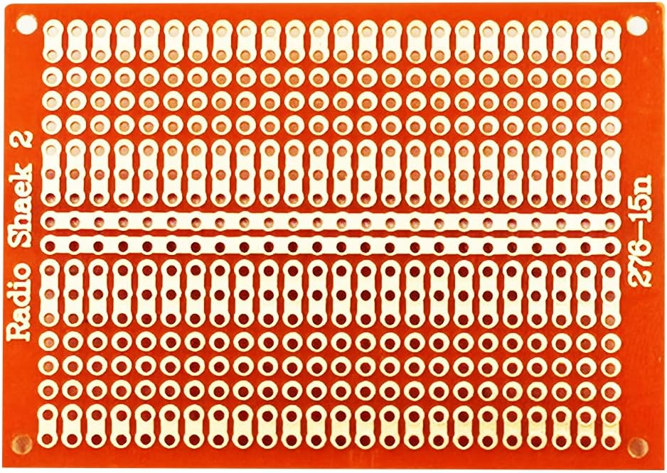
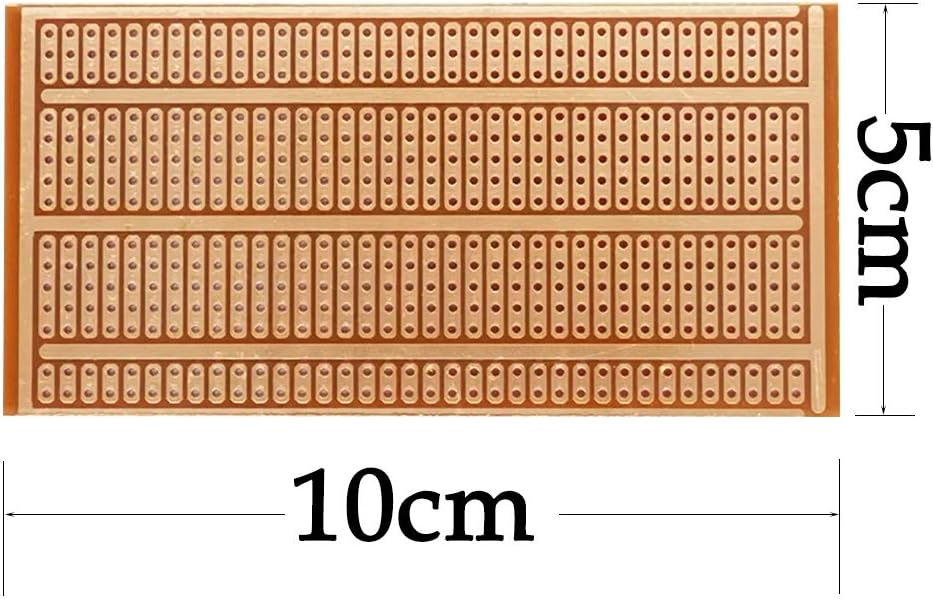
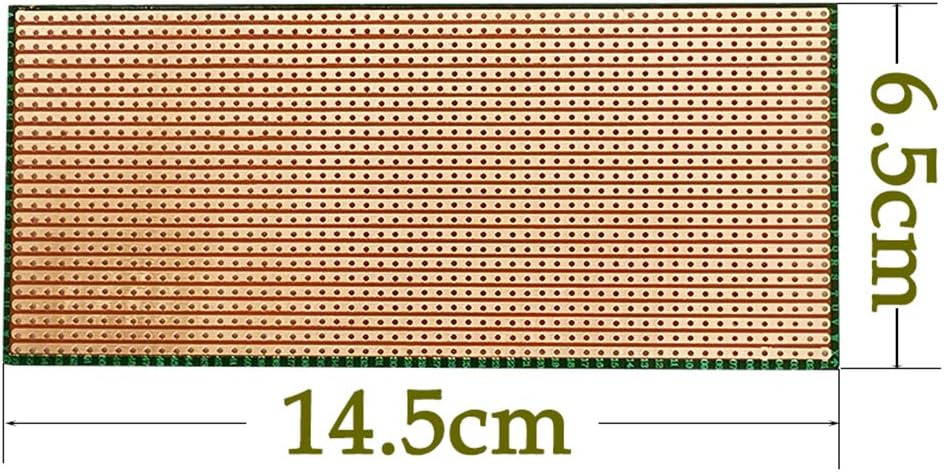
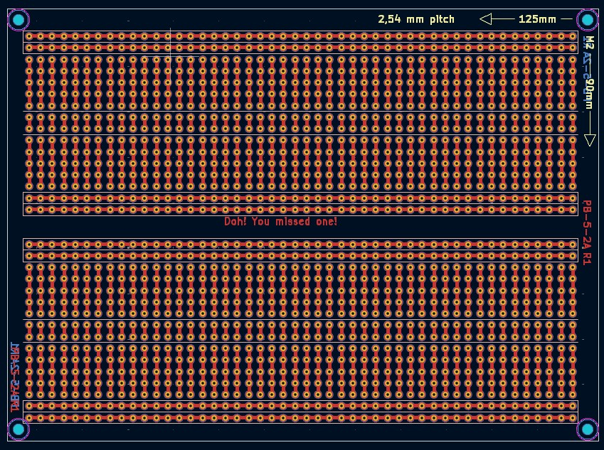

# Classic Stripboards

**Also known as:**

- Veroboard
- Vero board
- Strip protoboard
- Vero prototyping board
- Busboard Prototype System board

## Convention

starting point is always the center line splitting the rows

```

SB_<R>x<C>_<P>_[<O1><SL1>,...]_R<x>

- SB — literal prefix for “StripBoard”

- <R>x<C> — R rows × C columns of holes (rows across the short axis)

- <P> pitch in mm x 100

- <O> — orientation of copper strips:
    - H = horizontal (each strip runs across all columns)
    - V = vertical (each strip runs down all rows)
    - S = single hole

- <SL> — strip-length (number of contiguous holes per strip)
    - 0 indicates bus strip with no holes

- _R<x> — Revision Number

```

### Examples

**SB_18x24_254_2H24_36V3_108S_36V2**

- https://a.co/d/dxrGWNh



**SB_15x35_254_1H0_70V5_1H0_35V3_35V2**

- https://a.co/d/epf0U3b



**SB_24x56_254_24H56**

- https://a.co/d/6tkBWWo



**SB_32x48_254_4H48_192V5_96V2_4H48**


