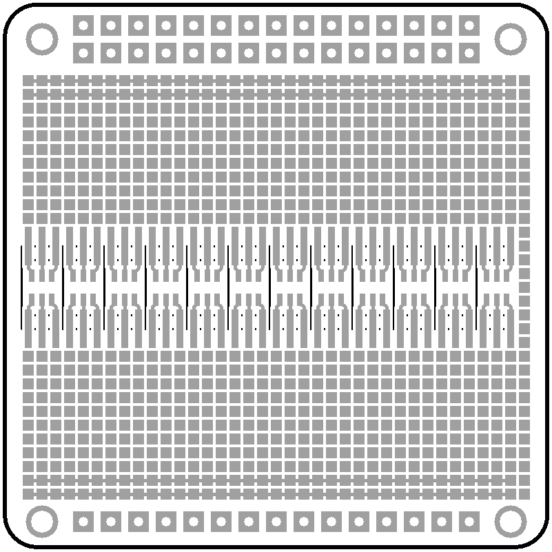
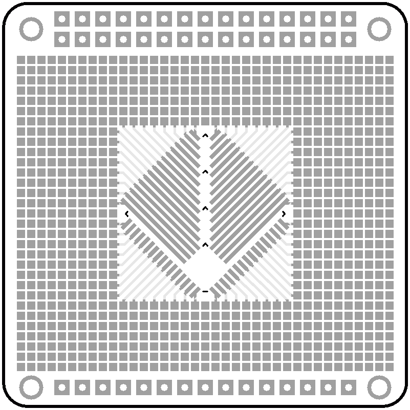

# kicad-proto-pcb

OSHW prototyping PCB with common SMD footprints

Made with kicad

Here is how it looks like :

Front

Back

## Acknowledgement

Derived from: [github.com/rxseger/kicad-proto-pcb](https://github.com/rxseger/kicad-proto-pcb/tree/curved)
